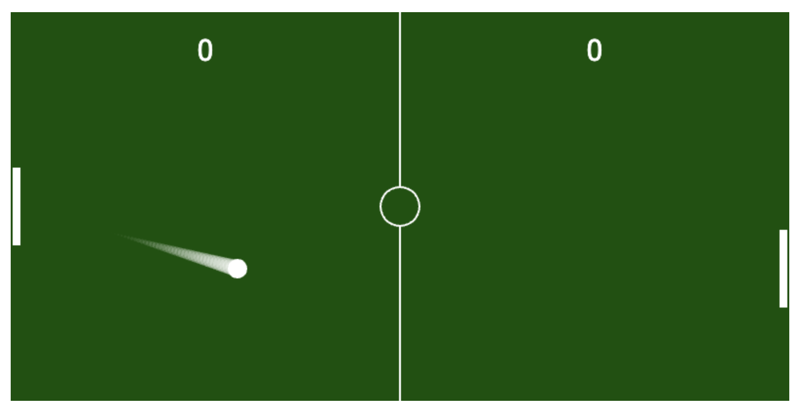

# Jogo Pong em JavaScript



Bem-vindo ao Jogo Pong em JavaScript! Este é um clone do clássico jogo Pong, desenvolvido usando HTML, CSS e JavaScript.

## Como Jogar

- Aperte a barra de espaço para começar
- Use as teclas de seta para cima e para baixo para controlar a raquete da esquerda.
- O objetivo é fazer com que a bola passe pela raquete do seu oponente e marque pontos.
- Mantenha o jogo em andamento e veja quem consegue a maior pontuação!

## Acesse o Jogo Online

Você pode jogar o Pong online acessando o seguinte link:

[**Jogue Pong Online**](https://game-pong-git-main-leosena777.vercel.app/)

## Executar Localmente

Se você quiser executar o jogo em sua máquina localmente, siga estas etapas:

### 1. Clone este repositório:

```bash
  git clone https://github.com/leosena777/game-pong.git
```

### 2. Navegue até o diretório do projeto:

```bash
  cd game-pong
```

### 3. Abra o arquivo index.html em seu navegador.

## Contribuição

Se você quiser contribuir para este projeto, sinta-se à vontade para abrir problemas (issues) e enviar pull requests com melhorias. Estamos ansiosos para ver suas sugestões!
